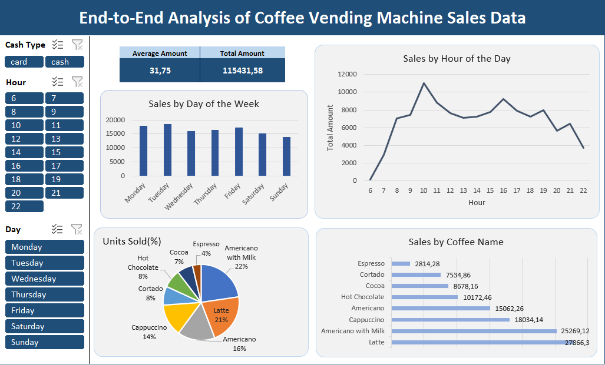

# Sales-Analysis

## Description
Comprehensive Analysis of Coffee Vending Machine Sales Data.
The objective of this project was to transform raw transaction data into an interactive dashboard, enabling business owners to make data-driven decisions based on detailed reporting.

## Tech Stack
* Microsoft Excel (Power Query, Pivot Tables, Pivot Charts, Slicers).

## Workflow
* **Power Query:** Performed data cleaning and transformation, including date/time processing and currency formatting.
* **Pivot Tables:** Conducted analysis of store performance and customer behavior patterns.
* **Dashboard:** Developed dynamic visualizations, featuring peak hour analysis, sales by product category and daily sales trends.

## Conclusion
**Peak Activity:** Sales peak at 10:00, with a secondary surge at 16:00, aligning with typical morning and afternoon coffee breaks.

**Top Performers:** Latte and Americano with Milk are the primary revenue drivers, accounting for approximately 45% of total income and the highest sales volume.

**Payment Preferences:** Card payments significantly outperform cash. Notably, no cash transactions were recorded at 6:00 and 8:00 throughout the analyzed period.

**Top Sales Day:** Tuesday emerged as the most profitable day overall.

**Early Morning Patterns:** 6:00 sales were exclusively recorded on Mondays and Tuesdays.

**Late-Night Trends:** Fridays has the highest volume of late-night purchases (22:00), suggesting a shift in consumer habits during the start of the weekend.

## Files
1. Oiginal file in `\Original File` folder.
2. Excel file with Interactive dashboards in 2 languages are in `\Excel` folder.

